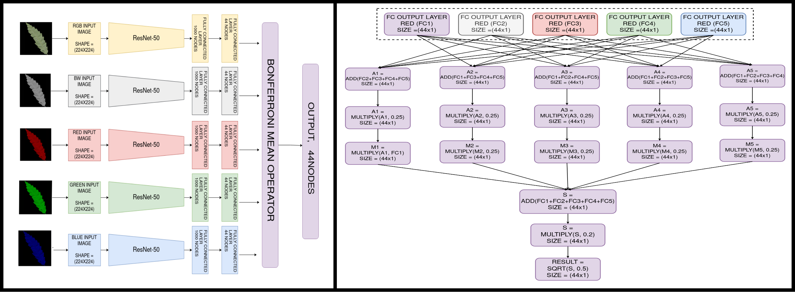

# BLeafNet: A Bonferroni mean operator based fusion of CNN models for plant identification using leaf image classification

Plants, the only natural source of oxygen, are the most important resources for every species in the world. A proper identification of plants is important for different fields. The observation of leaf characteristics is a popular method as leaves are easily available for examination. Researchers are increasingly applying image processing techniques for the identification of plants based on leaf images. In this paper, we have proposed a leaf image classification model, called BLeafNet, for plant identification, where the concept of deep learning is combined with Bonferroni fusion learning. Initially, we have designed five classification models, using ResNet-50 architecture, where five different inputs are separately used in the models. The inputs are the five variants of the leaf grayscale images, RGB, and three individual channels of RGB - red, green, and blue. For fusion of the five ResNet-50 outputs, we have used the Bonferroni mean operator as it expresses better connectivity among the confidence scores, and it also obtains better results than the individual models. We have also proposed a two-tier training method for properly training the end-to-end model. To evaluate the proposed model, we have used the Malayakew dataset, collected at the Royal Botanic Gardens in New England, which is a very challenging dataset as many leaves from different species have a very similar appearance. Besides, the proposed method is evaluated using the Leafsnap and the Flavia datasets. The obtained results on both the datasets confirm the superiority of the model as it outperforms the results achieved by many state-of-the-art models.

## Getting Started
### Prerequisites
You need Python3.X and conda package manager to run this tool

## Installation
The follwing steps can be used to install the required packages :
1. Clone the repository `git clone https://github.com/tre3x/BLeafNet.git`
2. Inialize a conda environment with neccessary packages `conda env create -f environment.yml`
3. Activate conda enviroment `conda activate BLeafNet`
Once the conda enviroment is activated, we can procees to training the model.

## Training
For training the model, the following command can be used 
```bash
python main.py --train {training path} --val {validation path} --epochs_base {base epoch} --epochs {final epoch} --batch {batch size} --steps {steps} 
```
{training path} : Path to the training leaf image set
{validation path} : Path to the validation leaf image set
{base epochs} : Number of epochs used while using base CNN models
{final epochs} : Number of epochs used while training final fused model
{batch size} : Batch Size used while training and validating
{Steps} : Number of steps per epochs while training

The final trained model is saved at `models/fused`. 